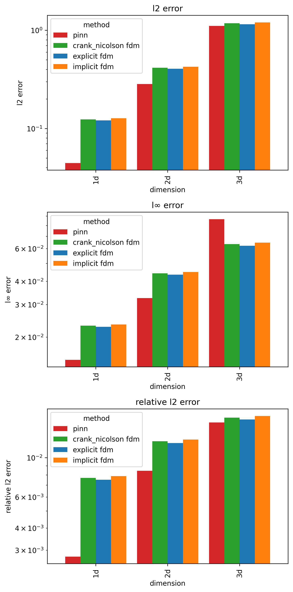

# PINN vs FDM: Heat Equation Benchmark

A comparative study of Physics-Informed Neural Networks (PINNs) and Finite Difference Methods (FDM) for solving the 1D, 2D, and 3D heat equation. This was submitted as a Final Year Project (MATH 499) in partial fulfillment of the Bachelor of Science in Computational Mathematics.

**Best PINN accuracy:** 99.72% (1D) · 99.16% (2D) · 98.42% (3D)

---

## Table of Contents

- [Overview](#overview)
- [Problem Setup](#problem-setup)
- [Methods](#methods)
- [PINN Architecture & Training](#pinn-architecture--training)
- [Results](#results)
- [Limitations](#limitations)
- [Dependencies](#dependencies)
- [References](#references)

---

## Overview

This project benchmarks four solvers against an analytical ground truth across three spatial dimensions:

- **Analytical** — Fourier series (N=50 terms), used as ground truth
- **Explicit FDM** — Forward Euler
- **Implicit FDM** — Backward Euler with sparse inversion
- **Crank-Nicolson FDM** — θ-method (θ=0.5)
- **PINN** — Fully connected network trained on PDE + BC + IC residuals

864 PINN hyperparameter configurations were searched across 1D, 2D, and 3D. All experiments ran on a Tesla P100-PCIE-16GB with deterministic CUDA (seed 42).

The notebook is at [eopfsp.ipynb](eopfsp.ipynb).

---

## Problem Setup

**Governing equation** (heat diffusion, copper):

$$\frac{\partial u}{\partial t} = \alpha \nabla^2 u, \qquad \alpha = 1.1644 \times 10^{-4}\ \text{m}^2/\text{s}$$

**Initial condition** (triangular wave, extended as products for 2D/3D):

$$u(x, 0) = \begin{cases} 2x/L & x \leq L/2 \\ 2(L-x)/L & x > L/2 \end{cases}$$

**Boundary conditions:** Homogeneous Dirichlet — $u = 0$ at all boundaries.

**Domain:** $[0,1]^n$, spatial grid $15^n$ ($dx = 0.0714$ m), $t \in [0, 60]$ s (100 steps).

| Dimension | Spatial Grid | Space-Time Points |
|-----------|--------------|-------------------|
| 1D | 15 nodes | 1,500 |
| 2D | 15×15 nodes | 22,500 |
| 3D | 15×15×15 nodes | 337,500 |

---

## Methods

### Finite Difference Methods

All three FDM schemes use the same stability parameter $r = \alpha \cdot dt/dx^2$, well below the critical threshold of 0.5:

| Scheme | 1D r | 2D r | 3D r |
|--------|------|------|------|
| Explicit | 0.0137 | 0.0274 | 0.0411 |
| Implicit | 0.0137 | 0.0274 | 0.0411 |
| Crank-Nicolson | 0.0137 | 0.0274 | 0.0411 |

### Physics-Informed Neural Networks

Collocation points are sampled via Latin Hypercube Sampling (LHS) and resampled every 100 epochs.

| Dimension | PDE Points | BC Points | IC Points | Total |
|-----------|-----------|-----------|-----------|-------|
| 1D | 3,000 | 1,000 | 2,000 | 6,000 |
| 2D | 30,000 | 10,000 | 20,000 | 60,000 |
| 3D | 60,000 | 20,000 | 40,000 | 120,000 |

---

## PINN Architecture & Training

**Loss function:**

$$\mathcal{L} = w_\text{PDE}\,\mathcal{L}_\text{PDE} + w_\text{BC}\,\mathcal{L}_\text{BC} + w_\text{IC}\,\mathcal{L}_\text{IC}$$

Three weighting strategies were tested: equal, adaptive_gradnorm, adaptive_lr_annealing.

**Training hyperparameters:**

| Parameter | Value |
|-----------|-------|
| Epochs | 6,000 |
| Learning rates | 5×10⁻³, 5×10⁻⁴ |
| Optimizers | Adam / Adam→LBFGS |
| LR decay | Exponential (γ=0.99) |
| Early stopping | loss > 16 after epoch 400 |
| Total configs searched | 864 |

**Best configuration per dimension:**

| Dim | Depth | Width | Activation | LR | Optimizer | Loss Weighting | Init | Time (s) | Memory (MB) |
|-----|-------|-------|------------|-----|-----------|----------------|------|----------|-------------|
| 1D | 2 | 8 | tanh | 5×10⁻³ | Adam | adaptive_gradnorm | Kaiming | 59.1 | 67 |
| 2D | 6 | 64 | tanh | 5×10⁻⁴ | Adam | adaptive_gradnorm | Xavier | 202.2 | 919 |
| 3D | 6 | 128 | tanh | 5×10⁻⁴ | Adam | adaptive_gradnorm | Xavier | 893.9 | 4,503 |

**Key findings:** tanh consistently outperformed GELU/SiLU/Mish. Adam-only achieved best results — Adam→LBFGS switching provided no benefit. Deeper and wider networks were required for higher dimensions.

**Final training losses:**

| Dim | PDE Loss | BC Loss | IC Loss | Total |
|-----|----------|---------|---------|-------|
| 1D | 2.17×10⁻⁸ | 7.78×10⁻⁷ | 3.11×10⁻⁵ | 3.31×10⁻⁵ |
| 2D | 3.34×10⁻⁸ | 7.07×10⁻⁶ | 2.73×10⁻⁵ | 4.79×10⁻⁵ |
| 3D | 1.81×10⁻⁸ | 1.40×10⁻⁵ | 4.30×10⁻⁵ | 3.94×10⁻⁵ |

---

## Results

| Dim | Method | Rel L2 Error (%) | L∞ Error | Accuracy (%) | Time (s) |
|-----|--------|-----------------|----------|--------------|----------|
| **1D** | Explicit FDM | 0.751 | 0.0228 | 99.25 | 0.003 |
| | Implicit FDM | 0.788 | 0.0234 | 99.21 | 0.015 |
| | Crank-Nicolson | 0.770 | 0.0231 | 99.23 | 0.010 |
| | **PINN** | **0.276** | **0.0151** | **99.72** | **59.1** |
| **2D** | Explicit FDM | 1.212 | 0.0435 | 98.79 | 0.005 |
| | Implicit FDM | 1.268 | 0.0449 | 98.73 | 0.040 |
| | Crank-Nicolson | 1.240 | 0.0442 | 98.76 | 0.041 |
| | **PINN** | **0.845** | **0.0325** | **99.16** | **202.2** |
| **3D** | Explicit FDM | 1.646 | 0.0622 | 98.35 | 0.011 |
| | Implicit FDM | 1.723 | 0.0646 | 98.28 | 2.50 |
| | Crank-Nicolson | 1.685 | 0.0635 | 98.32 | 2.59 |
| | **PINN** | **1.583** | 0.0866 | **98.42** | **893.9** |

PINN achieves **2.7× (1D)** and **1.4× (2D)** lower relative error than the best FDM, at 19,200–81,300× higher computational cost. In 3D, accuracy converges while the PINN becomes **2.8× more point-efficient** than FDM — a crossover driven by the curse of dimensionality.



---

## Limitations

- **Computational cost:** PINN requires 19,200–81,300× more time than explicit FDM. For low-dimensional, real-time applications, FDM is strictly faster.
- **Memory scaling:** 67 MB (1D) → 919 MB (2D) → 4,503 MB (3D). A GPU with ≥16 GB VRAM is required for 3D.
- **Hyperparameter sensitivity:** 864 configurations were needed to identify good PINN settings.
- **Domain restriction:** Implementation assumes $[0,1]^n$ unit hypercube. Irregular geometries require mesh-based or adaptive collocation strategies.
- **Analytical solver scaling:** 3D analytical computation is 860× slower than 2D due to triple-product Fourier summation — practical only as offline ground truth.

---

## Dependencies

```
torch>=2.0.0
numpy>=1.26.0
matplotlib>=3.7.0
pandas>=2.0.0
scipy>=1.11.0
scikit-learn>=1.3.0
```

NVIDIA GPU with ≥16 GB VRAM recommended for 3D experiments.

---

## References

M. Raissi, P. Perdikaris, and G. E. Karniadakis, *Physics Informed Deep Learning (Part I): Data-driven Solutions of Nonlinear Partial Differential Equations*, arXiv:1711.10561, 2017. https://arxiv.org/abs/1711.10561

---

